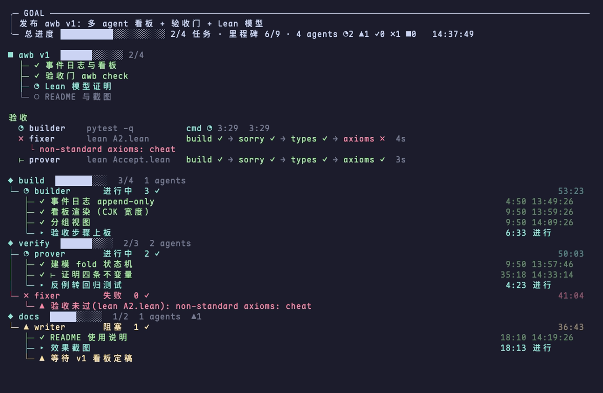

<p align="center"></p>

# awb

tmux agent workbench. A milestone board for many agents (claude, codex, any CLI), with
an acceptance gate that decides when a milestone counts as done.

The name is also the logo: `a` and `b` are the two lenses of a pair of glasses and `w` is
the `ω` mouth, as in (・ω・). It watches your agents.



The board above (`AWB_VIEW=full`, demo data) shows the task tree, the acceptance runs with
each step, and per-group agents with their milestones; `⊢` marks a milestone that passed
`awb check`; the full view tags an unverified finished milestone with a dim `自报`.

The brief view (default) is for the person who owns the goal. A line belongs on it only if
it is a decision that person has to make, or a change in how far the goal is; each fact
appears once. Coordination between agents (who holds a resource, who waits for whom) shows
only when it breaks, as a 需要你 or 异常 line. Every addition to the view is held to this.

Both the brief view and the Lark card are drawn from `awb snapshot` and nothing else
(`awb snapshot | awb view` draws the same board), in one layout, most important first,
since the view is cut at the pane height:

1. Title: the goal's first line. Its other lines say what the goal is (definition, scope).
2. One-sentence verdict without numbers: needs you or not · whether the metric rose in 24
   hours, reached its target or misses its deadline · how many anomalies.
3. The metric with its history and a linear time-to-target marked `（估）` (hidden past the
   `--by` deadline), task progress, how long ago the board last changed, and one movement
   line: the last hour, the last 24 hours, and how many milestones were verified.
4. 需要你: permission dialogs, failed or dead agents, `ask` tasks, each with how long it waited.
5. 下一步: the main line's next open steps.
6. 异常, one line per agent: a bottleneck (an issue or PR, `#N`, two or more blocked agents
   wait for), no code change, a session that contradicts the report, a silent agent that has
   no Claude session to report for it, a board nobody writes to. Silence counts after
   `AWB_SILENT` (3600 s), not the nudge threshold `AWB_STALE` (600 s): on a real three-day log
   the median gap between two updates of one agent was 772 s.

`awb replay [STEP]` judges these rules on a real log: it renders the board as of every STEP
seconds (`AWB_NOW`, from the log alone) and lists each anomaly as an episode with its start
and length. Session state, pane liveness and code fingerprints are not in the log, so rules
that need them do not fire in a replay.
7. News (the last 3; lines with one `--key` are one fact, the latest shows), the task tree
   without the steps already under 下一步 (folded on the card), acceptance runs. Agents show
   only in 需要你 and 异常; `AWB_VIEW=full` lists every agent.

## Model

- `.awb/events.jsonl` is the single source of truth: append-only events
  (goal/start/now/done/status/task/news). `hold`/`release` (shared resources) carry no agent
  id, so like `metric` the proven fold drops them and only render reads them.
- The board pane folds the events every second and redraws on change. It shows the goal,
  each agent's current and finished milestones, durations and idle time, never process output.
- Agents report with the same `awb` CLI. The main agent changes content by appending
  events and changes presentation by editing `awb` itself.
- An agent's own `done` is a claim. `awb check` runs a check the main agent chose; only a
  passing check marks the milestone verified (`⊢`), and a rejected check blocks `done`
  until a later check passes.
- `awb metric NAME VALUE TARGET [NOTE]` is a render-only indicator: the latest event shows
  under GOAL in the brief view as `NAME VALUE / TARGET ▕bar▏pct%`, followed by the history of
  that name. Record every measurement with it and keep numbers out of `awb goal`. It has no id
  and is ignored by the proven fold/audit — the fold drops any unknown event whose id is not
  a string (or whose agent is absent), matching the Lean parser's `_ => none` (a fixed
  unknown-event differential case pins this) — and render reads it from the same piped event
  array, so it never changes agent state and the log is read once per redraw.

## Install

```sh
curl -fsSL https://raw.githubusercontent.com/cklxx/awb/main/install.sh | sh
awb selftest
```

This installs `awb` (needs sh, tmux, jq) to `~/.local/bin` and the agent skill to
`~/.claude/skills/awb-workbench`, from the latest release. Run `./install.sh` in a clone to
symlink both instead. Agents without a skill mechanism (codex, ...) read the same manual
with `awb skill`; `awb` itself points agents there.

## Chat-driven: main agent + awb + session socket

You talk to one Claude, the main agent; the board is for watching. Nothing in Claude's
configuration changes and workers need not know awb.

A board taller than its pane scrolls: `j`/`k`, arrow keys or the mouse wheel move by lines,
space/`b` by pages, `g`/`G` jump to the top/end, `q` quits.

```sh
awb board                 # board beside the main agent's tmux pane
awb tui -g g w1 worker    # a Claude worker; prints "w1 session: <name>" once it is ready
```

The main agent dispatches with `msg=$(awb send w1 "<task>")` and its SendMessage tool
(`to: <name>`, `notify_when_idle: true`), which travels over Claude's own per-session socket
and reaches the worker even mid-turn. The message carries a key; the worker's reply echoes it
and the main records `awb reply w1 <key> "<result>"`. On an idle notice without a reply,
`awb idle w1` asks once and then marks the task blocked for the user. One open task per
worker; `awb pending` recovers open tasks after a restart. `model/tla/AwbLoop.tla` shows why:
with the earlier protocol TLC finds a reply closing the wrong task, a held message counted as
done, and a task lost; the keyed protocol passes both "done only for done work" and "every
task ends done or blocked". The skill (`awb skill`) spells out this protocol.
`tui` waits for the worker to register with Claude before typing anything; it never answers
the folder-trust prompt, it asks you to. Several boards: one `.awb` per project, or `AWB_DIR`.

## Use

```sh
awb up                                   # tmux session: board on top, work area below
awb goal "ship v1"
awb run -g build a1 builder -- claude    # pane per agent; exit 0 -> done, else failed
awb run -g docs  a2 writer  -- codex
awb tui -g main assistant helper "task"  # resident interactive claude TUI; command from
                                         # AWB_TUI_CMD (default: claude-db if on PATH, else claude)

# reported by the agent (or the main agent on its behalf)
awb now   a1 "event log"
awb done  a1
awb block a3 "waiting for review"; awb unblock a3
awb finish a1
awb fail  a2 "tests red"

# task tree and progress feed (brief view shows them)
awb task t1 wip "build API"                  # STATE todo|wip|review|blocked|done|drop|ask
awb task t2 todo "auth" t1 a1                # [TEXT] [PARENT] [OWNER]; re-issue to update
awb news "API merged"                        # board shows the last 3
awb news --key val@15000 "val loss 1.888"    # one key = one fact: a later line replaces it
awb metric tps 32 40 "V100 target"      # brief: one value/target bar under GOAL

# acceptance
awb check a1 -- pytest -q ~/accept/test_a1.py       # any command, exit 0 = accepted
awb check a1 --lean proj ~/accept/ACCEPT.lean       # Lean 4: build, no sorry, theorems typecheck
                                                    # with standard axioms only
awb pr a1                                           # open a PR for a1's branch, only after a pass
awb merge 42 --watch                                # merge once the newest verdict on the head approves
                                                    # and the required checks ran green
awb hold gpu0 a1 "bench"; awb release gpu0          # one holder per shared resource
awb render                                          # one-shot render, works outside tmux
awb reset                                           # clear all events
awb down                                            # kill the session
```

Board knobs: `AWB_VIEW=brief|full` (default brief), `AWB_STALE=SECS` lists agents silent
that long (default 600), `AWB_INTERVAL` refresh seconds (default 1), `AWB_METRIC_STALE=SECS` shows the latest reading's
age and drops the time-to-target estimate once that reading is older (default 21600; the
estimate itself counts from the latest reading), `AWB_TASK_STALE=SECS` tags an open task root
nobody updated that long (default 21600), `AWB_FROZEN=SECS`
flags a running agent whose git working tree is unchanged that long (default 900).

Keep acceptance files outside the agent's working directory so the agent cannot edit them.

Each check shows on the board under 验收 as it runs: `build → sorry → types → axioms` for
Lean (one `cmd` step otherwise), with a timer on the running step and the reason under a
failed one. ACCEPT.lean must use top-level named `theorem`s; `example`, `lemma`,
`namespace` or any unrecognised theorem syntax fails the check rather than being skipped.
A warm Lean check of `model/` takes about 2s.

Status: ◔ running · ✓ done · ▲ blocked · ✗ failed · ■ dead (pane gone).
`tmux -S .awb/sock attach -t awb` attaches from another terminal (for a deep project path the
socket is `/tmp/awb-UID-HASH.sock`, since unix socket paths are limited to about 104 bytes).

## Lark (Feishu) topics

With [lark-cli](https://github.com/larksuite/cli) logged in as a bot, every board mirrors into
its own topic of one Lark topic group. `install.sh` asks for the group (or reads
`AWB_LARK_CHAT=oc_xxx`); `awb-lark setup oc_xxx` sets it later. The bot must be a member of
the group.

- One board = one topic, and every update lands on that topic's card, patched in place:
  the metric with its trend chart, task progress and the last hour's movement, what needs
  you, a table of agents (current milestone, time, verified milestones), the latest news,
  and the task tree folded. Nothing else is posted.
- A failed patch fails that sync only; the next one retries the same card. Syncs of one board
  never overlap: the lock holds its owner's pid and is taken over only when that process is
  gone, the watch loop kills a sync hung for `AWB_LARK_STALE` (300 s), and the topic is
  created with an idempotency key so a send repeated after a crash reuses it
  (`model/tla/AwbLark.tla`). Lark stops
  patching a card after 14 days, so at 13 days the board opens a new topic and the old card
  is replaced by a pointer to it.
- The board syncs by itself once a minute while `awb board` / `awb up` runs
  (`AWB_LARK_EVERY`); `awb-lark sync` does it by hand, `--dry-run` prints the card JSON.
- The mapping is `$AWB_DIR/lark.json` (chat, root message), so it follows the
  board. The card is built from `awb snapshot`, the same data as the brief view.

## Notify agents

```sh
awb tell a1 "rebase on main, then re-run the check"   # typed into the agent's TUI pane + Enter
awb peers                                             # ID PANE CLAUDE-SESSION STATUS
awb stale                                             # agents silent >= AWB_STALE seconds
awb nudge                                             # loop: remind silent agents every AWB_NUDGE_EVERY
```

`awb nudge` (loop cadence `AWB_NUDGE_POLL`, default 60 s) also fingerprints each agent's
git working tree (`.awb/diffs`): a running agent whose tree is unchanged for `AWB_FROZEN`
seconds (default 900) is reminded at most once per `AWB_NUDGE_EVERY` (default 900 s — the
60 s poll is not the throttle) to commit a minimal change or `awb block`; blocked agents and
non-git directories are skipped.

- `nudge` also looks for a Claude worker whose session is idle for `AWB_STUCK_AFTER` (120 s)
  with a tool call printed as text in its pane tail (`AWB_STUCK_RE`, default
  `DSML|<invoke name=|</?function_calls>`): some models emit the call syntax instead of calling,
  and the session then looks idle while the board says running. It is told to re-issue at most
  once per `AWB_STUCK_EVERY` (600 s), and flagged under 异常 until the session works again.
- `tell` works for any TUI agent (claude, codex, ...) and uses a named tmux buffer, so your
  own paste buffer is untouched. Claude queues it if a turn is running. After Enter it
  captures the pane (joined lines) and reads the last line starting with a prompt (`❯`
  Claude, `>` codex/shell), falling back to the last non-empty line; if that input line
  still holds the paste — the raw text, or Claude's collapsed `[Pasted text #N +K lines]`
  placeholder — it re-sends Enter up to `AWB_TELL_MAX_ENTER` (default 2), then prints the
  stuck line to stderr and returns non-zero (without aborting a `check`/`nudge` round).
  The input line is below Claude's divider/footer, so matching the screen tail would miss
  it. A submitted message clears the input line (output / empty prompt), so a plain shell
  or codex pane is never retried.
- A rejected `awb check` tells the agent the reason automatically, unless the agent ran the
  check from its own pane (`AWB_NOTIFY=0` turns this off).
- The board reads each Claude agent's live session state from `~/.claude/sessions` (read
  only) and does not trust the self-report over it. A session on a permission dialog shows as
  `▲ 待批准` with the dialog kind and its age, and `awb stale` prints it as `ID MINUTES waiting`,
  whatever the agent last reported; `tell` and `nudge` refuse to type into it, since typed
  text plus Enter would answer the dialog. tell reads the registry again before the paste and
  before Enter; a dialog that opens in the gap between a read and a keystroke still takes
  it (TLC counterexample in `model/tla/AwbWaitRace.cfg`), so prefer SendMessage for Claude. A self-report the session contradicts is flagged
  under 会话实况: reported done or failed while the session is busy, or reported running
  while the session has been idle for `AWB_STALE` seconds. The dialog's own text is often
  scrolled off the pane by queued messages, so the registry state is used, not the screen.
- For Claude agents, `peers` maps each agent to its Claude Code session name via
  `~/.claude/sessions`. A main agent that is itself a Claude session can then message them with
  its `SendMessage` tool, which goes over Claude's own per-session socket and reaches the agent
  even mid-turn. awb does not speak that socket protocol itself: it is internal, versioned and
  authenticated. MCP channels, the documented push route, are unavailable with a custom
  `ANTHROPIC_BASE_URL`.
- Agents started outside awb (existing sessions) are mapped in `.awb/panes`, one
  `ID PANE` per line (an optional third column overrides the working directory used for
  change detection); it overrides panes from start events.

## Probes

A task can read its state from an artifact instead of a self-report (design and proofs:
[docs/probe.md](docs/probe.md)):

```sh
awb task t7 wip "merge #671" "" "" --probe 'awb probe pr 671'
awb task t1 wip "train" "" de --probe 'awb probe log runs/x.log "step ([0-9]+)/([0-9]+)"'
awb probe run                                         # loop: run due probes, log readings
```

A probe prints `STATE text` and exits 0; anything else is a failed read and the task shows
`?` (unknown). A reading shows its age and expires after `AWB_PROBE_FRESH` seconds (default
600); `done` and `drop` do not expire. An owner of a probed task that is fresh `wip` or
`review` is not listed as stale.

## Contributing and releases

Changes land by PR. Fix on a branch, then gate and open the PR with awb itself:

```sh
awb check fix1 -- ./awb selftest     # the acceptance gate
awb pr fix1                          # pushes the branch; refuses without a passing check
```

CI does not test; it only publishes: pushing a tag `vX.Y.Z` that matches `VERSION` in `awb`
creates a GitHub release with `awb`, `install.sh` and `SKILL.md` attached. Releases are at
most daily: PRs accumulate on main without touching `VERSION`; a release is one PR that only
bumps `VERSION`, then the tag.

## Verification chain

Every link from the event log to a merged PR is either proven in Lean or tested against the
proven model:

| link | how | where |
|---|---|---|
| status fold (events → agent state) | proven: duration frozen iff ended, no `done` while a check is rejected, only known states, non-negative durations | `model/AwbModel.lean` |
| jq fold in `awb` = Lean fold | differential test on random logs (`awb selftest`, 200 logs; 1000 run clean) | `awb state` vs `awbmodel fold` |
| brief view / Lark card (events → sections) | proven: every agent is shown in one section, and an agent with a rejected check is never shown idle; the jq snapshot is differentially tested against it (every 4th random log) | `model/Brief.lean` vs `awb snapshot` |
| protocol audit | proven: the one-pass monitor reports nothing iff every event obeys the rules given its prefix (`audit_iff_clean`); corollary: every PR in a clean log followed a passing check | `model/Audit.lean` |
| deliverables | `awb check` (tests, or Lean with kernel-checked theorems and standard axioms only) | `awb check` |
| merge | `awb pr` refuses without a passing check or with audit violations, and logs the PR for the audit; `awb merge` merges only on an approve of the current head (newest verdict wins, whole-line match) with the required checks green, pinned by `--match-head-commit` | `awb pr`, `awb merge` |
| dispatch/report loop (main ↔ worker) | TLA+ with liveness: no false done, no lost task | `model/tla/AwbLoop.tla` |
| tell vs a permission dialog | TLA+: a dialog the registry reported before a keystroke is never typed into (registry re-read before the paste and every Enter); `AwbWaitRace.cfg` shows the window no check closes | `model/tla/AwbWait.tla` |
| Lark sync (ticks, manual syncs, crashes vs one topic) | TLA+: one topic per board and the card never goes back to an older state; `AwbLarkOld*.cfg` reproduce two topics and a regressed card from breaking the lock by age | `model/tla/AwbLark.tla` |
| probe fold (readings → task state) | proven: the accepted reading is the newest parsed one, a failed read changes nothing, `done` shows only from a done reading, expired readings show unknown; jq = Lean by the same differential test | `model/Probe.lean` |
| probe timing (late, failed, foreign readings) | TLA+: `AwbProbeOld.cfg` shows false done, stale values, older-over-newer and waiting-as-stale; `AwbProbeFixed.cfg` passes with liveness | `model/tla/AwbProbe.tla` |
| concurrency (check, pr, tell vs the agent) | TLA+, model-checked with TLC: `*Old.cfg` reproduces the races of 0.0.5, `*Fixed.cfg` passes | `model/tla/` |

Races TLC found in 0.0.5, now fixed and covered by selftest: a check that passed after the
agent had started its next milestone verified that new milestone; two checks of one agent
interleaved their events, so the audit flagged an honest pass; `awb pr` could open a PR while
a new check was running; two concurrent `tell`s into one pane merged into one prompt or lost a
message. Fixes: a per-agent lock around `check` and `pr`, a check verifies only the milestone
it started on (otherwise it is rejected as stale), and `tell` uses a per-call buffer under a
per-pane lock. In 0.0.7 a process that had unlocked still removed that lock on exit, after
another had taken it, and two tells merged; `AwbTellExitTrap.cfg` reproduces it and `unlock`
now forgets the lock. Run TLC with
`java -cp tla2tools.jar tlc2.TLC -config AwbCheckFixed.cfg -deadlock AwbCheck` in `model/tla/`.

Audit rules, per agent: a verified milestone must follow a passing check (forged `verified`
events are caught), a PR must follow a passing check, and `done` must not be claimed while a
check is rejected. Violations show on the board under 审计违规 and via `awb audit`.

`model/Main.lean` compiles the proven fold and monitor into `awbmodel`, which `awb` finds at
`model/.lake/build/bin/awbmodel` (or `AWB_MODEL`); `./install.sh` in a clone builds it when
Lean is installed. Without it, `awb audit` is unavailable and selftest skips the
differential test. Proofs are checked with:

```sh
awb check model --lean model model/Accept.lean
```

Limits: events are appended by agents, so the audit flags a forged `verified` event but
cannot stop an agent that also forges the check events; the jq fold is tested against the
model, not proven.
